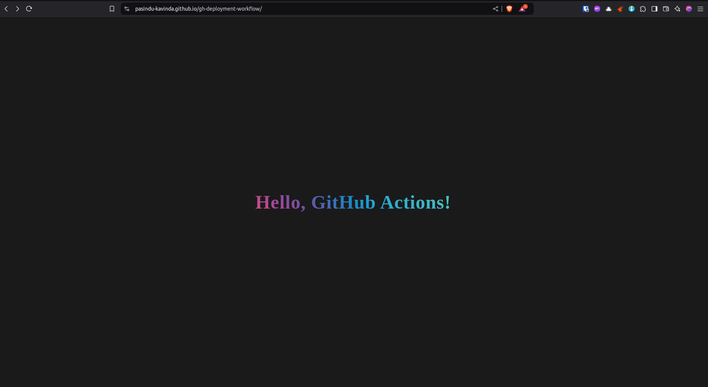
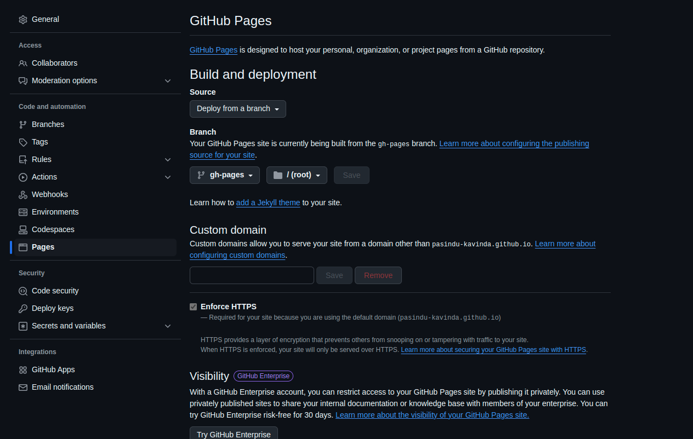

# GitHub Pages Deployment

> Roadmap.sh Project URL: https://roadmap.sh/projects/github-actions-deployment-workflow

## Output

## Explanation
This GitHub Actions workflow is designed to automate the deployment of a static website to GitHub Pages.

We need to make the following changes

> **Settings** > **Pages** > **Source**

Change to `gh-pages` branch and `/(root)` directory.

